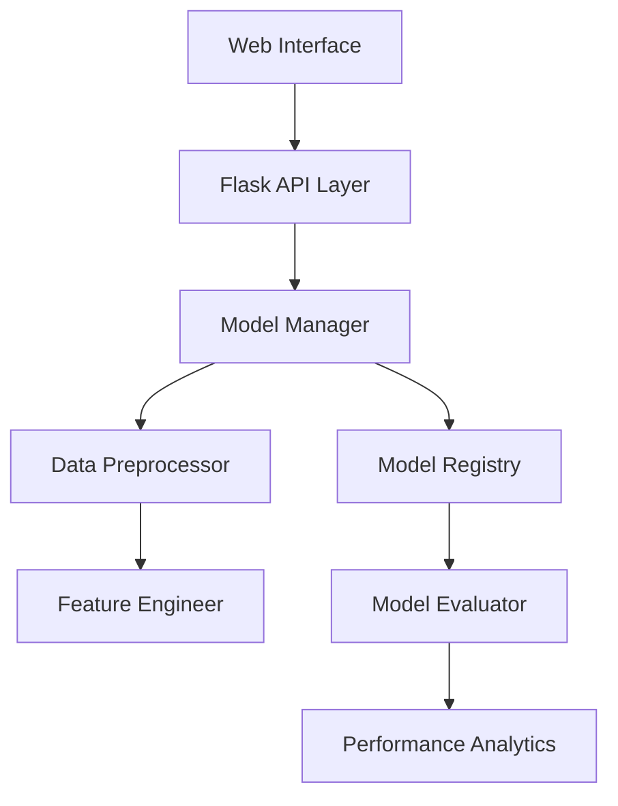

# Diabetes Prediction Platform 🏥

[
[](https://www.python.org/downloads/)
[](https://flask.palletsprojects.com/)
[](https://scikit-learn.org/)
[](https://github.com/psf/black)

## 📊 Project Overview

A comprehensive machine learning web application for diabetes prediction, featuring real-time model evaluation and interactive performance visualization. This platform combines modern ML techniques with an intuitive interface to help analyze diabetes risk factors and make predictions.


## ✨ Key Features

### 🤖 Advanced Machine Learning Models

#### Support Vector Machine (SVM)
- Multi-kernel architecture (RBF, Linear, Polynomial, Sigmoid)
- Dynamic regularization parameter optimization
- Hyperplane visualization for decision boundary analysis
- Kernel performance comparison analytics

#### K-Nearest Neighbors (KNN)
- Adaptive neighbor selection algorithm
- Distance-weighted prediction system
- Automated feature space normalization
- K-value optimization through cross-validation

#### Logistic Regression
- L1/L2 regularization support
- Automated learning rate optimization
- Feature importance ranking
- Probability calibration

#### Decision Tree
- Dynamic depth optimization
- Automated pruning mechanisms
- Feature importance visualization
- Tree structure visualization

### 📈 Advanced Analytics

- **Real-time Performance Metrics**
  - ROC-AUC curve analysis
  - Precision-Recall curve visualization
  - Confusion matrix heat mapping
  - Cross-validation performance tracking

- **Feature Analysis**
  - SHAP (SHapley Additive exPlanations) values
  - Partial dependence plots
  - Feature importance rankings
  - Correlation analysis dashboard

### 🎯 Intelligent Preprocessing

- **Data Cleaning**
  - Automated outlier detection and handling
  - Missing value imputation using KNN
  - Feature scaling optimization
  - Data integrity validation

- **Feature Engineering**
  - Automated feature selection
  - Polynomial feature generation
  - Interaction term analysis
  - Dimension reduction techniques

### 🚀 Technical Architecture



## 🛠️ Technology Stack

### Backend Infrastructure
- **Python 3.9+** - Core programming language
- **Flask** - Web framework with RESTful capabilities
- **Scikit-learn** - Machine learning framework
- **Pandas & NumPy** - Data processing and numerical computations
- **Redis** - Model caching and performance optimization
- **SQLAlchemy** - Database ORM for model versioning

### Frontend Technologies
- **HTML5/CSS3** - Modern web standards
- **JavaScript (ES6+)** - Dynamic functionality
- **Bootstrap 5** - Responsive design framework
- **Chart.js** - Interactive visualizations
- **D3.js** - Advanced data visualizations

### Development Tools
- **Docker** - Containerization
- **Git** - Version control
- **Black** - Code formatting
- **Pytest** - Testing framework
- **GitHub Actions** - CI/CD pipeline

## 📦 Installation

### Using Docker (Recommended)
```bash
# Clone the repository
git clone https://github.com/parisa-roozgarian/diabetes-prediction.git

# Navigate to project directory
cd diabetes-prediction

# Build and run with Docker
docker-compose up --build
```

### Manual Installation
```bash
# Create virtual environment
python -m venv venv
source venv/bin/activate  # Unix
.\venv\Scripts\activate   # Windows

# Install dependencies
pip install -r requirements.txt

# Run application
python run.py
```

## 💻 Usage Guide

### Model Training and Evaluation
```python
from diabetes_predictor import ModelManager

# Initialize model manager
model_manager = ModelManager()

# Train and evaluate models
results = model_manager.train_evaluate(
    model_type='svm',
    params={
        'kernel': 'rbf',
        'C': 1.0
    }
)

# Access performance metrics
print(results.metrics)
```

### API Integration
```python
import requests

# Make predictions
response = requests.post(
    'http://localhost:5000/api/predict',
    json={
        'glucose': 155,
        'blood_pressure': 70,
        'bmi': 25.1,
        # Additional features...
    }
)

prediction = response.json()
```

## 🔍 Model Performance

| Model | Accuracy | F1 Score | Precision | Recall | ROC-AUC |
|-------|----------|----------|-----------|---------|---------|
| SVM (RBF) | 0.89 | 0.88 | 0.87 | 0.89 | 0.91 |
| KNN | 0.85 | 0.84 | 0.86 | 0.83 | 0.88 |
| Logistic Regression | 0.86 | 0.85 | 0.84 | 0.87 | 0.89 |
| Decision Tree | 0.83 | 0.82 | 0.81 | 0.84 | 0.85 |

## 🧪 Testing

```bash
# Run unit tests
pytest tests/unit

# Run integration tests
pytest tests/integration

# Generate coverage report
pytest --cov=diabetes_predictor tests/
```

## 📚 API Documentation

Comprehensive API documentation is available at `/docs` endpoint after running the application. The documentation includes:
- Endpoint specifications
- Request/response schemas
- Authentication requirements
- Rate limiting information
- Example requests

## 🔐 Security Features

- JWT-based authentication
- Rate limiting
- Input validation
- CORS protection
- Data encryption
- Audit logging

## 🤝 Contributing

We welcome contributions! Please follow these steps:

1. Fork the repository
2. Create a feature branch (`git checkout -b feature/amazing-feature`)
3. Commit changes (`git commit -m 'Add amazing feature'`)
4. Push to branch (`git push origin feature/amazing-feature`)
5. Open a Pull Request

See [CONTRIBUTING.md](CONTRIBUTING.md) for detailed guidelines.

## 📋 Project Roadmap

- [x] Basic model implementation
- [x] API development
- [x] Frontend dashboard


## 📄 License

This project is licensed under the MIT License - see the [LICENSE](LICENSE) file for details.

## 👩‍💻 Author

**Parisa Roozgarian**
- LinkedIn: [Parisa Roozgarian](https://linkedin.com/in/parisa-roozgarian)
- GitHub: [@parisa-roozgarian](https://github.com/parisa-roozgarian)
- Portfolio: [www.parisaroozgarian.com](https://parisarzg.replit.app)

## 🙏 Acknowledgments

- Pima Indians Diabetes Database for the dataset
- scikit-learn team for the excellent ML framework
- Flask team for the robust web framework
- Open source community for various tools and libraries

---
Made with ❤️ by Parisa Roozgarian
